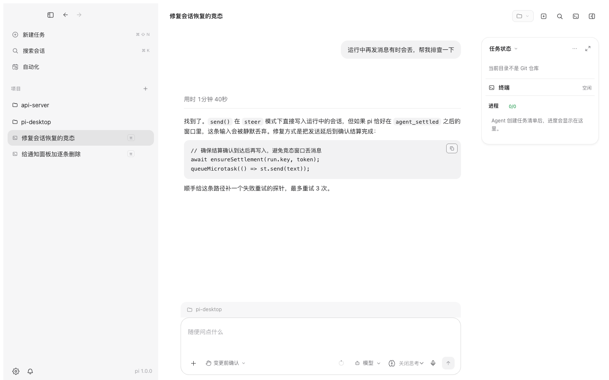
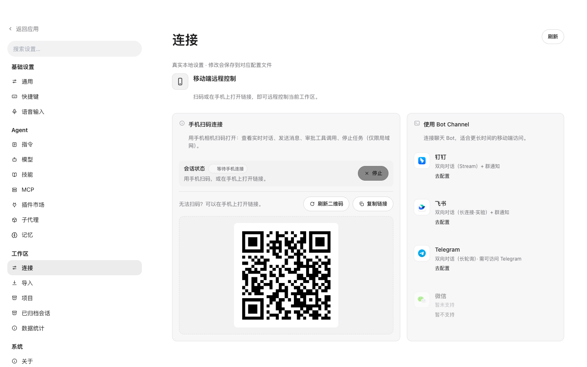

# PI Desktop

[English](./README.md) | **简体中文**

[](https://github.com/xiaoliu10/pi-desktop/releases/latest)
[](./LICENSE)
[](https://www.electronjs.org/)
[](https://www.npmjs.com/package/@earendil-works/pi-coding-agent)

**[pi 编码代理](https://www.npmjs.com/package/@earendil-works/pi-coding-agent)的桌面工作台——过程全程可见，动作逐个确认，掌控权始终在你手里。**

PI Desktop 把本地的 **pi CLI** 装进一个真正的桌面应用：流式对话完整展示代理过程（思考、工具调用、子代理、计划进度），行级变更审查，内置终端，还能用手机远程控制。模型自带——认证留在 pi 内部，前端永不接触。

| 全过程可见的对话 | 手机远程控制 |
| --- | --- |
|  |  |

## 为什么选 PI Desktop

- **过程全部可见。** 思考流式输出、工具调用、子代理活动、计划清单、甚至上下文压缩——代理做的每件事都实时呈现在时间线上，带用时统计和一键复制的代码块。
- **受监督的自治。** 每次文件编辑和命令执行都先询问（仅此一次 / 本会话总是允许 / 拒绝），可按任务切换为自动编辑或完全访问。Review 面板展示相对 Git HEAD 的净变更 diff——绝不把别的会话的改动算作自己的。
- **自愈式运行。** 结算确认丢失、「假运行」卡死——代理 UI 永远转圈的两大经典病因——都被自动检测并恢复，错误直接在会话内渲染，而不是一条死路横幅。
- **不打断心流。** 任务运行中也能编辑已发送的消息（转为排队追问或立即转向）、排队后续输入、随时打断，多个会话跨项目并存。
- **离开电脑也能用。** 扫二维码在局域网内用手机操控当前工作区——看实时对话、审批工具调用、停止任务。或接入 Bot 渠道（钉钉 / 飞书 / Telegram）进行更长时间的会话和群通知。
- **是工作台，不只是聊天框。** 多标签终端（node-pty + xterm）后台保活，计划模式实时清单视图，`@` 文件引用，图片附件，可选语音输入。
- **模型自带。** 供应商配置与认证由 pi 管理：OpenAI、Anthropic、订阅登录，或任意 OpenAI 兼容端点（DeepSeek、Ollama、LM Studio、vLLM、网关）。会话中随时切换模型；语音用独立 ASR 模型。
- **中英双语。** 界面在设置中一键切换，另有明暗主题与字体选择。

## 快速开始

> 前置要求：已在终端安装并验证 [pi CLI](https://www.npmjs.com/package/@earendil-works/pi-coding-agent)（认证与模型由 pi 自身管理）；源码构建需 Node.js ≥ 20。

从 [Releases](https://github.com/xiaoliu10/pi-desktop/releases/latest) 下载对应平台的安装包：

- macOS（Apple Silicon）：`PI.Desktop-<version>-arm64.dmg`
- Windows：`PI.Desktop.Setup.<version>.exe`

或从源码运行：

```bash
pnpm install
pnpm dev        # Vite HMR + Electron
# 或
pnpm build && pnpm start
```

> 若 `pnpm install` 时未下载 Electron 二进制（pnpm 10+ 默认拦截依赖构建脚本），运行 `pnpm rebuild electron`。

### 首次使用

1. 启动 PI Desktop——已有的 CLI 会话自动出现在左侧，按项目分组。
2. 任意会话只读浏览；点击「在桌面端继续」创建接续副本，CLI 原件保持不动。
3. 新建会话，选择项目信任与工具权限模式，挑选模型，发出第一个任务。

已在 macOS 与 Windows 上对 pi **0.85.1+** 完成本地验证。未知版本保持可读但禁止执行。

## 工作原理

```
┌─────────────── PI Desktop (Electron) ───────────────┐
│  渲染进程    React UI：对话 · 审查 · 终端 ·        │
│             计划 · 插件 · 设置 · 远程               │
├────────────── contextBridge（类型化 IPC）────────────┤
│  主进程      会话发现 · 自愈 RPC 看门狗 ·           │
│             权限 · safeStorage                      │
└──────────────────────┬──────────────────────────────┘
                       │ pi --mode rpc
┌──────────────────────▼──────────────────────────────┐
│  pi CLI：代理循环 · 工具 · 供应商 · 认证            │
│  （会话、模型与技能都留在 pi）                      │
└─────────────────────────────────────────────────────┘
```

PI Desktop 通过 pi 的 RPC 模式驱动本地 pi。CLI 会话从磁盘发现并实时跟随，不做导入也不复制。桌面设置只存路径与界面偏好——API key 与订阅凭证永远不离开 pi。

## 功能一览

- **CLI 会话自动出现**——按 cwd 分组、跟随磁盘历史；接续副本保证原件只读。
- **逐动作工具确认**——专用 pi 扩展实现允许 / 拒绝 / 取消对话框，支持会话级记忆授权；权限模式在输入框随时切换（这是应用层确认，不是操作系统沙箱）。
- **真实审查**——Review 面板聚合会话内文件变更的净 diff（行级），改动一目了然。
- **内置终端**——顶栏开关的多标签终端面板；会话在后台保活。
- **计划模式**——代理执行时计划文档与清单进度实时渲染，支持快照回看与一键「执行计划」。
- **子代理**——本地定义子代理；它们作为独立 pi 会话运行，活动卡片实时嵌入对话。
- **MCP**——stdio 与 Streamable HTTP 服务器向 pi 注册工具，设置界面统一管理。
- **插件与技能市场**——统一页面发现、安装、管理 pi 资源（指令、技能、扩展）。
- **记忆**——经 pi-memory 扩展可选启用长期/项目记忆，设置中可浏览可编辑。
- **去重通知**——队列、转向、结算事件只提醒一次，绝不刷屏。
- **语音输入**——云端 ASR（OpenAI 转写端点或 Chat 多模态网关，404 自动回退），转写只追加到输入框、绝不自动发送。配置细节见[语音输入配置](./docs/voice-input.md)。
- **双语界面与主题**——中英一键切换，明暗主题，字体可选。

## 开发

```bash
pnpm install
pnpm dev            # 开发编排（Vite + tsc + Electron）
pnpm typecheck      # 主进程 + 渲染进程
pnpm test           # vitest 单元 + 浏览器测试
pnpm preview:ui     # 纯 Web UI 预览（无 Electron / 模型密钥 / 用户文件）
```

真实进程隔离测试（无外部模型调用）：

```bash
PI_TEST_EXECUTABLE=/opt/homebrew/bin/pi pnpm exec vitest run tests
```

[`docs/`](./docs) 下的开发文档为中文：[RPC 协议基线](./docs/pi-protocol-baseline.md) · [工具权限边界](./docs/pi-permission-boundary.md) · [设置页面实现](./docs/settings-implementation.md) · [Phase 2 交付与验证](./docs/pi-integration-verification.md)。

## 与参考项目的差异

界面形态参考 [vastsa/PI-Desktop](https://github.com/vastsa/PI-Desktop)（LGPL-3.0，未复用代码）。该项目以 Electron 配 Rust 宿主核心；PI Desktop 是聚焦 pi CLI 集成的独立纯 Node 实现：Node 主进程承担宿主核心职责，无需 Rust 工具链。

## 参与贡献

欢迎 Issue 与 PR。请先开 Issue 讨论方案；提交前确保 `pnpm typecheck && pnpm test` 通过。

## 致谢

- [pi coding agent](https://www.npmjs.com/package/@earendil-works/pi-coding-agent)——本工作台驱动的代理内核
- 产品形态与架构思路参考 [vastsa/PI-Desktop](https://github.com/vastsa/PI-Desktop)（LGPL-3.0）；未复用代码
- [Electron](https://www.electronjs.org/) · [React](https://react.dev/) · [Vite](https://vite.dev/) · [zustand](https://zustand.docs.pmnd.rs/) · [react-markdown](https://github.com/remarkjs/react-markdown) · [highlight.js](https://highlightjs.org/)

## 许可证

[Apache License 2.0](./LICENSE) 授权。
