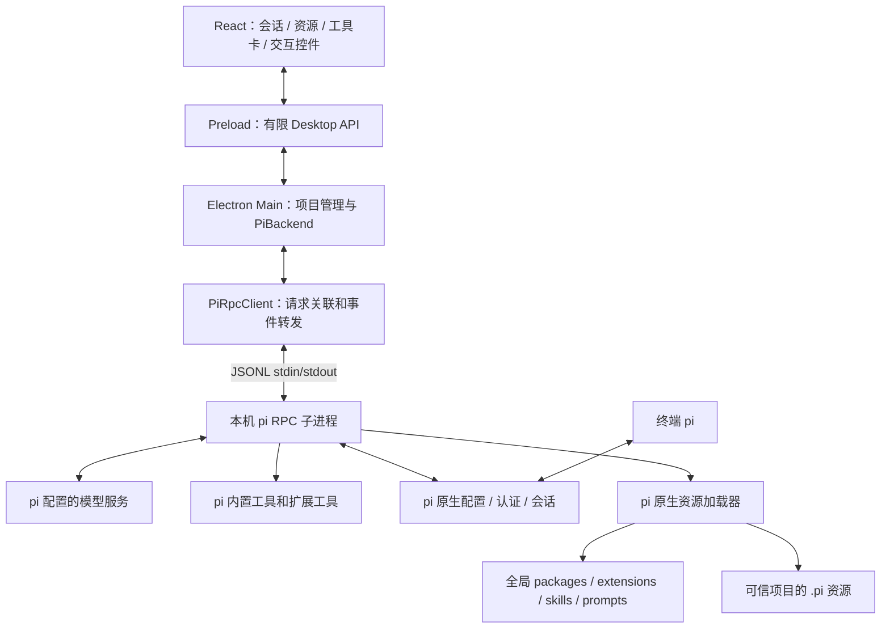
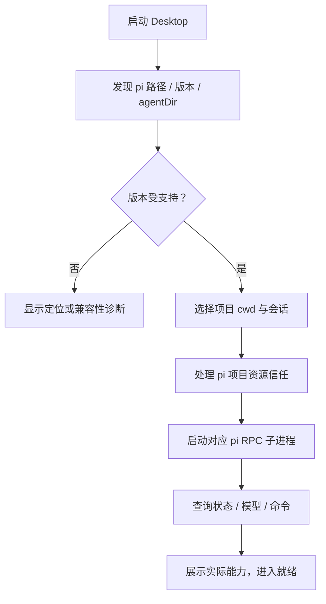
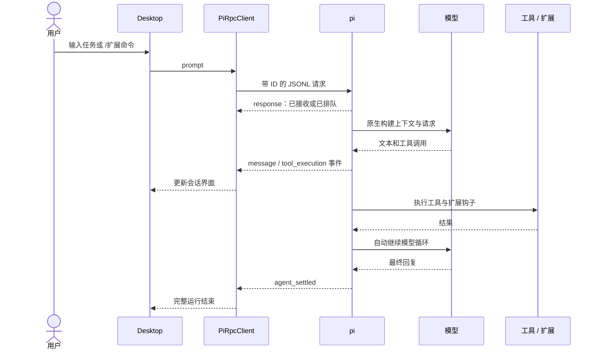
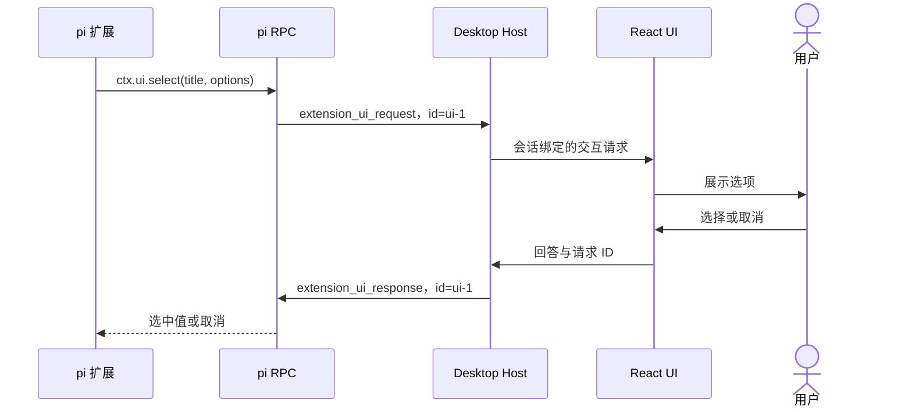

# PI Desktop：以本地 pi 为内核的开发流程

架构修订：2026-09-20。当前优先级是先完成 [UI 复刻](./ui-replica-spec.md) 与用户审阅，再进入本文的 pi 接入阶段。本文是当前开发依据，替代自研 AgentRuntime 方案。**2026-09-20 更新：用户要求提前执行第二阶段，生产入口现已切换本地 pi；实际实现范围与验证结果见 [接入交付](./pi-integration-verification.md)。本文保留目标架构说明，未完成项不能视为已支持。** 实现任务见 [Agent 领取板](./agent-task-board.md)。[旧方案](./legacy-custom-runtime-workflow.md)仅供理解原型，不再执行旧 A 系列任务。

## 1. 目标与联动范围

Desktop 是本地 pi 的图形客户端。用户在终端配置模型、安装 pi packages 或编写 extensions 后，Desktop 应发现这些资源，在相同的项目和配置环境中启动 pi，并展示工具执行、插件命令、状态组件和交互。

首版包括：

1. 使用本机 pi 执行推理、工具调用、队列、中断和会话持久化。
2. 复用同一 agentDir 和项目 cwd 下的模型、认证、extensions、Skills、提示词模板。
3. 展示资源来源、实际加载状态与兼容级别，调用扩展命令和工具。
4. 将 pi 的标准 Extension UI 交互映射为桌面控件。
5. **自动显示 pi CLI 已有和新建的 session，无需导入或先手动添加项目；CLI 继续写入历史后，Desktop 自动更新。** 浏览与顺序接续分开实现。

“联动”首版定义为**共享配置与资源、直接浏览并跟随 CLI 会话历史、顺序接续会话**。附着任意已运行的终端 pi 进程、多客户端实时操控同一会话，需要共同服务或额外 IPC 扩展，作为后续范围；不能让两个独立进程同时写同一会话文件。

## 2. 已核实的本机基线

本次只读取安装元数据、随包官方文档和扩展源码，没有启动插件、发送模型请求或修改 pi 配置与认证。

| 项目 | 本机情况 |
| --- | --- |
| 命令入口 | `/opt/homebrew/bin/pi` |
| 实际入口 | `/opt/homebrew/lib/node_modules/@earendil-works/pi-coding-agent/dist/bundle/cli.js` |
| 包名 / 版本 | `@earendil-works/pi-coding-agent` / `0.85.1` |
| 默认配置目录 | `/Users/jason/.pi/agent` |
| 已发现的全局扩展 | `extensions/plan-mode` |
| 其他已发现目录 | `sessions`、`prompts`、`npm` 等；目录存在不等于资源已加载 |

旧教程中的包名可能是 `@mariozechner/pi-coding-agent`。本机已经使用 `@earendil-works/pi-coding-agent`，后续实现必须按检测版本适配，不照搬旧 SDK 签名。其他机器不得硬编码上述路径。

本机证据来自安装目录中的 `docs/rpc.md`、`sdk.md`、`packages.md`、`security.md`、`environment-variables.md` 和本地 `plan-mode/index.ts`。在线主分支持续变化，任务验收应记录版本。

## 3. 接入决策：首版使用本地 CLI RPC

| 路线 | 优点 | 代价 | 决策 |
| --- | --- | --- | --- |
| 本地 `pi --mode rpc` | 直接运行用户安装版本，复用原生配置及资源加载，隔离桌面进程 | 需版本检测；部分终端 UI 不经过 RPC 暴露 | **首版采用** |
| 独立 Node sidecar 嵌入完整 coding-agent SDK | 可使用 ResourceLoader、SessionManager 并定制交互 | 要维护 SDK 与本地 CLI 的版本兼容 | RPC 实际缺口需要时再评估 |
| 仅接入 pi-agent-core / pi-ai | 控制底层循环和模型调用 | 仍需补齐配置、扩展、包和会话等上层能力 | 不满足本次重点 |

官方提供 RPC 和 SDK 两条路线。选择 RPC 是本项目为“直接联动本地 pi”作出的工程决策，并非官方强制。Desktop 使用自己的 `PiBackend` 抽象，将来可替换底层接入方式，但首版不同时实现两个后端。

[参考项目](https://github.com/vastsa/PI-Desktop)提供了桌面工作区和 pi sidecar 的分层思路。其桌面插件格式与 pi packages 不是同一种格式。本项目先兼容用户原有 pi 资源，不要求每个包重新包装成专有桌面插件。

## 4. 架构与数据所有权



| 数据 / 能力 | 所有者 | Desktop 负责什么 |
| --- | --- | --- |
| 模型配置、认证、模型请求 | pi | 展示可用模型，发送选择指令，不向 Renderer 复制认证 |
| 模型循环、工具调用、压缩 | pi | 展示事件，不实现第二套循环 |
| 会话 JSONL、分支、扩展状态 | pi | 只读索引、按协议打开、顺序交接 |
| 已安装资源及其配置 | pi | 发现、解释状态、刷新 |
| 项目列表、布局、置顶等桌面元数据 | Desktop | 存放于 Electron userData，关联 pi 会话路径和 ID |
| 插件交互界面 | Desktop 适配层 | 将标准 UI 请求映射到 React 控件 |
| 变更审查 | Desktop Review | 读取工作区或 Git 差异，不依赖旧工具的专有 diff |

旧 Store 的模型与对话不能继续作为新内核的第二份事实来源。旧记录保留只读；迁移需显式执行，不能将原型的 events.jsonl 直接覆盖到 pi 的会话文件。

## 5. 启动与连接流程



发现顺序：显式选择的可执行文件 → 继承 PATH → 平台约定路径候选。macOS 图形应用的 PATH 可能与终端不同，应提供手动选择；不通过执行任意 shell 启动脚本寻找 pi。

配置根采用选定值或继承的 `PI_CODING_AGENT_DIR`，未设置才默认 `~/.pi/agent`。会话目录还需考虑 `PI_CODING_AGENT_SESSION_DIR`。明确展示当前 cwd、配置根和可执行版本，方便排查“终端有插件、Desktop 没有”。

用参数数组启动程序，不拼接 shell 命令。每个活动 Desktop 会话绑定专用子进程；同一会话文件不能有两个 Desktop 写入者。空闲进程回收后，重新连接要查询状态和命令并恢复 UI。

0.85.1 的 RPC 模式不自动弹出项目信任询问。默认 ask 且没有既存信任决定时，会跳过受保护的项目资源。Desktop 应沿用 pi 的信任语义，在启动前解释并收集本次加载决定；不能为了全部加载就给所有项目默认加 `--approve`。

全局扩展与项目资源的加载范围不同。被信任策略跳过时应显示具体原因。pi 启动可能涉及包安装或网络行为，资源扫描页面不得直接等同于执行全部插件。

## 6. 一条用户任务的运行流程



请求示例，以检测版本支持的协议为准：

```json
{"id":"req-1","type":"prompt","message":"分析这个项目"}
{"id":"req-2","type":"get_commands"}
{"id":"req-3","type":"get_state"}
```

`prompt` 成功响应仅代表接收成功。0.85.1 的 `agent_end` 可能只表示一次底层运行结束，之后还会重试、压缩或处理队列；完整结束依据 `agent_settled`。其他版本需要明确兼容策略。

运行中输入按意图映射到 pi 的 `steer` 或 `follow_up`；Desktop 不维护第二套隐式队列。0.85.1 的停止交互应先 `clear_queue` 再 `abort`，否则剩余队列可能继续执行；被清除的输入应展示或恢复给用户。

RPC 按 LF 分帧，保留跨块缓冲与 UTF-8 解码状态，不按 Unicode 文本分隔符切割。请求响应和异步事件分别处理。stderr 用作诊断，stdout 中非协议内容不能直接成为聊天消息。进程重启后不自动重放可能已执行的任务。

## 7. 本地 pi 插件发现与展示

pi package 是分发单元，可能包含 extensions、skills、prompt templates、themes。单个本地 `.ts` 扩展也可独立存在。UI 可统称“插件与资源”，内部保留类型和来源。

发现来源包括全局目录、项目 `.pi` 目录、配置中的显式路径，以及 npm、Git、本地路径 packages。遵守版本对应的包含、排除、去重、相对路径规则；不能只扫描 `~/.pi/agent/extensions`。

`get_commands` 返回实际注册的扩展命令、Skills 和提示词模板，但**不是完整插件清单**。纯工具、纯钩子扩展可以没有命令，主题也不是命令。静态目录只能证明发现或安装，不能证明当前会话加载成功。

资源页至少显示：名称、类型、来源、可得的版本、作用域、发现状态、运行时证据、UI 兼容等级、错误和限制。运行时未知显示“未确认”，不能靠没有报错猜测成功。未被 RPC 暴露的信息可用后续诊断扩展补足，不能编造不存在的查询 API。

### 兼容矩阵

| pi 资源 / 能力 | 执行方式 | Desktop 展示 |
| --- | --- | --- |
| 扩展工具、生命周期钩子 | pi 原生加载 | 通用工具卡、输出、扩展错误 |
| registerCommand | `/命令` 经 prompt 发送 | 命令面板、补全 |
| Skills、提示词模板 | pi 原生展开 | 资源列表、调用入口 |
| notify、setStatus | Extension UI 事件 | 通知、按 key 管理的状态项 |
| 字符串数组 setWidget | Extension UI 事件 | 输入区上方或下方文本组件 |
| select、confirm、input、editor | Extension UI 请求/响应 | 选择、确认、输入、多行编辑框 |
| setTitle、set_editor_text | Extension UI 事件 | 显示标题、输入框预填；不得自动发送 |
| 自定义工具/消息的终端渲染器 | TUI 输出不直接成为桌面 UI | 先展示结构化数据和通用文本，专用效果后续适配 |
| ctx.ui.custom、自定义 footer/header/editor、组件工厂 widget | RPC 不支持或降级 | 标明终端 UI 限制，不承诺原样展示 |
| pi 终端主题、快捷键 | TUI 语义 | 可列出资源，不自动等同于 CSS 和桌面快捷键 |

任意终端 UI 不能自动转换为 React。未来若需原样展示，可以另加 PTY 终端视图；这属于另一种展示方式，不与 RPC 控件兼容混淆。

## 8. Extension UI 交互流程



按 `sessionId + processGeneration + requestId` 路由，防止切换会话或重启后把旧回答发送给新进程。四类对话方法需要响应，通知和状态更新无需回包。

超时由 pi 端处理；Desktop 同步关闭过期弹窗、丢弃迟到回答，不把超时当作允许。切换会话仍保留后台待处理请求。进程退出后清理其所有交互。

widget 文字可能含 ANSI 颜色；首版去除或转换有限安全样式，按文本展示，不执行终端控制序列，不直接渲染未经处理的 HTML。

### 首个真实案例：本机 plan-mode

静态检查发现该扩展注册 `/plan`、`/todos`，使用 setStatus、字符串数组 setWidget、notify、select、editor，并通过 pi 会话条目保存状态。终端快捷键不会被 RPC 自动映射到桌面。

目标验收：发现扩展 → 调用 `/plan` → 展示计划状态与待办 widget → 展示下一步选择 → 编辑计划 → 回答回传扩展继续执行 → 重开会话恢复扩展状态。

这是待运行验证的预期，不是已通过的结论。生成计划需要模型或测试 Provider；UI 桥接可使用隔离的测试扩展验收。

**不能让旧 Desktop Plan/Goal 与 pi 扩展重复管理模式。** 迁移时隐藏或禁用旧模式入口，计划能力由实际加载的扩展提供。未来的 Desktop 工作模式也应通过 pi 扩展机制接入，并明确冲突策略。

## 9. 安装后刷新与会话接续

### 终端安装后生效

```text
用户在终端 pi install
  → pi 更新配置和包目录
  → Desktop 发现变化并提示待刷新
  → 完全空闲时重新创建对应 RPC 子进程
  → 打开原会话文件
  → 重新查询状态和命令，清理旧 UI
  → 展示实际可用资源
```

首版采用空闲重启加载，不假设存在通用 `reload_extensions` RPC，也不把 TUI `/reload` 当作 RPC API。运行中安装不能静默中断任务；队列、待处理弹窗、重试也属于非空闲状态。

先复用终端安装入口，Desktop 提供发现、刷新和诊断。Desktop 内安装、更新、卸载和启停另立任务，说明其影响范围；不维护第二套隐蔽包仓库。

### 核心需求：CLI 的 session 在 Desktop 直接可见

典型用户路径：

```text
在项目 A 的终端运行 pi 并开始对话
  → pi 将 session 写入原生会话目录
  → Desktop 自动发现该 session，并按会话头中的 cwd 归入项目 A
  → 点击可查看已保存的用户消息、助手回复、工具调用和结果
  → CLI 继续工作，Desktop 跟随新的完整记录更新
```

这是直接浏览同一份 pi 会话数据，不是手动导入、复制后各自维护。Desktop 未预先添加项目 A 时，仍应从会话元数据发现它；项目目录失效时历史仍可查看，并提示无法在该目录继续执行。

| 场景 | Desktop 的目标行为 |
| --- | --- |
| Desktop 启动前已有 CLI 会话 | 自动列出，可直接查看历史 |
| Desktop 开着时 CLI 新建会话 | 自动出现，无需重启或手动导入 |
| CLI 向已有会话追加记录 | 自动更新列表时间、摘要与当前打开的历史 |
| CLI 正在工作，用户点击会话 | 以只读观察方式查看，不另启代理争夺写入 |
| 用户选择“在 Desktop 继续” | 单独走接续与占用检查，不把查看操作当成接管 |
| 用户使用非默认会话目录 | 支持选择额外目录，显示来源；无法从全局设置发现的 CLI --session-dir 路径不假装已自动发现 |

**实现方法：** 初始只读扫描 + 目录/文件监听 + 防抖增量读取 + 低频重扫兜底。新增、追加、重命名、删除、截断和文件替换都要处理。只消费完整 JSONL 记录，尚未写完的尾行等待下一次更新；按真实路径和会话 ID 建立稳定标识，避免重复列表项。使用 header 的 cwd 分组，不能仅靠编码目录名反推出项目路径。

读取时保留 id/parentId 的树结构、压缩和扩展条目，不按文件行顺序把不同分支拼成一次对话。仅凭磁盘记录无法确认 CLI 当前内存中的选中分支时，明确显示所选历史分支，不声称完全镜像终端当前视图。只读浏览不得调用可能自动迁移或写回原文件的加载 API。

**刷新边界：** 文件监听只能显示 pi 已经落盘的记录，不能从 JSONL 推断当前逐 token 输出、运行中工具进度或准确 busy 状态。UI 展示“只读观察 / 最近同步时间”，不能仅凭 mtime 显示“正在运行”。如果将来要求 CLI 与 Desktop 同时逐字流式显示，再增加共同事件服务或 CLI 扩展桥接；这不是本次基本可见性的前置条件。

**验收目标：** 本地正常文件系统中，一条完整记录落盘后 2 秒内可见（测试目标，不是现有能力保证）；监听漏报可由兜底重扫恢复。测试全程不启动模型、不执行扩展、不写源会话、不修改 CLI 状态。任务由 P05 实现，P08 接入 UI，作为后端阶段首要用户场景。

### 终端与 Desktop 顺序接续

1. 对所选 pi 会话目录建立只读索引，保留项目、名称、时间和会话 ID。
2. 使用 pi 原生会话协议打开，保留分支、压缩条目和扩展状态，不只提取聊天文本。
3. Desktop 防止自己的多个进程双写；对于无法确认的外部 CLI 占用，采用只读或分叉流程。
4. Desktop 释放会话进程后，终端可打开对应 pi 会话路径。

Desktop 自建锁不能约束普通 CLI，不能声称解决了跨终端互斥。无法可靠识别占用时提示先结束 CLI 或创建副本；实时双端协作需要共同协调机制。

## 10. 权限和信任边界

pi 扩展是用户信任的本地代码，可以直接调用 Node 能力。Desktop IPC 弹窗只能约束经过该路径的行为，无法拦截任意扩展的直接文件或网络操作。子进程隔离不等于操作系统沙箱。

旧 PermissionService 只包住原型的旧工具，不会自动保护 pi。若保留询问/自动编辑策略，需要可信 Desktop 扩展通过 pi 工具钩子与 UI 协议接入，验证内置和扩展工具覆盖范围；无法分类的工具要明确处理。直接 Node 操作仍不能承诺拦截。

权限桥接未验收前，不展示旧权限选项好像它们仍然生效。项目资源信任、插件确认对话、工具操作权限分别管理。

认证由 pi 使用；前端只获取脱敏模型列表和认证可用性，不接收 auth.json、完整环境变量或秘密日志。

## 11. 原型迁移路线

| 当前模块 | 新路线 |
| --- | --- |
| src/main/agent/runtime.ts | 主链路替换为 PiBackend，不继续完善自研循环 |
| src/main/providers/* | 模型请求交给 pi，不新增自研适配器 |
| src/main/agent/tools.ts | 使用 pi 工具和扩展，不重复执行同一调用 |
| src/main/agent/permissions.ts | 按前述边界重新桥接，不能照搬保护声明 |
| src/main/store.ts | 保留桌面元数据；旧对话只读，新会话归 pi |
| Preload / shared API | 增加后端状态、资源列表和扩展交互契约 |
| React 会话、工具卡、输入框 | 改为消费 pi 事件，保留可复用 UI |
| Review | 工作区或 Git 差异，不再依赖旧工具 diff |

计划新增 `src/main/pi/`：发现、RPC 传输、后端会话、资源目录、会话索引、事件映射。新增 `src/shared/pi.ts`：Desktop 自己的类型契约。这些是本项目待实现模块，不是 pi 自带 API。

## 12. 开发与验收顺序

先完成 UI 任务 **U01～U07** 并交用户审阅，再领取 pi 接入任务 **P01～P10**；旧 A 系列全部撤销。pi 阶段先冻结版本和契约，再并行开发传输、资源目录与会话索引，最后由集成任务接入已验收 UI。

最终验收要求：

- 模型只配置一次，Desktop 使用本地 pi 配置，不复制认证到 Renderer。
- 扩展只安装一次，packages 和独立 extensions 均可发现，加载状态可以解释。
- plan-mode 或同等隔离测试扩展的命令、状态、widget、选择和编辑可实际操作。
- 用户任务只交给 pi 一次，多轮工具、队列、取消和完成由 pi 驱动。
- CLI 既有会话和新建会话无需导入即可直接显示，落盘更新自动同步；查看不启动第二个代理，继续执行才走接续流程。
- 会话可由 CLI 与 Desktop 顺序接续，不在无法确认占用时双写。
- TUI 专用能力明确标记，不将工具能运行等同于插件全部 UI 兼容。
- 无 Key 的模拟测试与真实模型验收分开记录；原型现有 19 个测试不代表新架构已通过。

## 13. 官方资料

以安装版本随附文档为实现依据，在线主分支供学习：

- [RPC 与 Extension UI](https://github.com/earendil-works/pi/blob/main/packages/coding-agent/docs/rpc.md)
- [完整 coding-agent SDK](https://github.com/earendil-works/pi/blob/main/packages/coding-agent/docs/sdk.md)
- [Packages](https://github.com/earendil-works/pi/blob/main/packages/coding-agent/docs/packages.md)
- [Extensions](https://github.com/earendil-works/pi/blob/main/packages/coding-agent/docs/extensions.md)
- [安全与项目信任](https://github.com/earendil-works/pi/blob/main/packages/coding-agent/docs/security.md)
- [环境变量](https://github.com/earendil-works/pi/blob/main/packages/coding-agent/docs/environment-variables.md)
