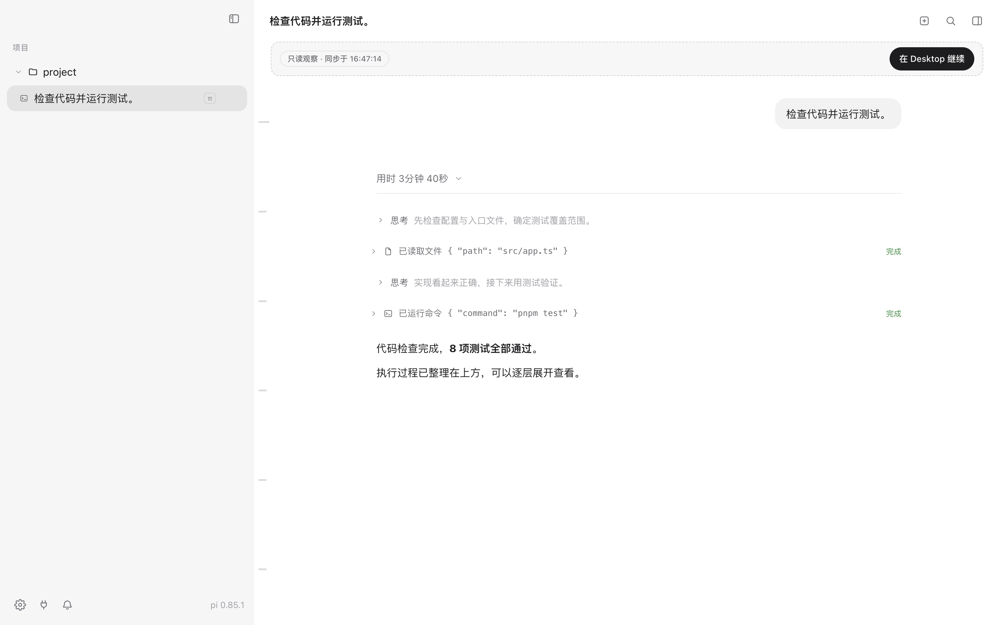
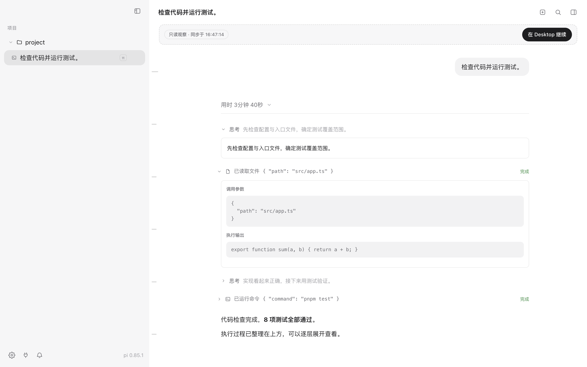

# 对话执行过程折叠

2026-09-20：生产与预览 ChatView 共用两层折叠展示。

- 每条用户输入之后的助手执行过程归入一个总折叠区，默认收起。
- 总标题显示工具调用数、思考段数、运行状态与失败数量。
- 展开总折叠区后，按顺序显示思考、进度说明、每次工具调用；各项仍默认收起。
- 展开单次工具调用后展示参数、输出与差异（如果消息提供）；思考显示 pi 返回的实际 thinking 内容，不生成或推测缺失的思考。
- 请求、流式进度和结果按 toolCallId 合并，不按工具名称合并。已保存结果优先于迟到的流式进度。
- 已落盘的助手消息按 timestamp 从流式副本中去重；总分组和工具项使用稳定 ID，避免保存后重置展开状态。
- 最后执行步骤之后的回复文字保持直接可见；没有工具或思考的普通回复不强制折叠。
- 两层使用原生 details/summary，支持键盘操作，手动展开状态不会因运行状态更新而被强制切换。

核心文件：`src/renderer/replica/chat/execution.ts`、`ChatView.tsx`、`chat.css`、`src/renderer/pi/adapter.ts`。

验证：类型检查与构建通过；全量测试 103 通过、1 项真实模型隔离联调默认跳过。新增 5 项覆盖分组、请求结果配对、跨轮隔离、流式去重、稳定 ID 与默认折叠。Electron 实测验证外层展开、内层展开、再次收起外层后保留内层选择。截图使用临时原生会话夹具，未改写用户历史。

