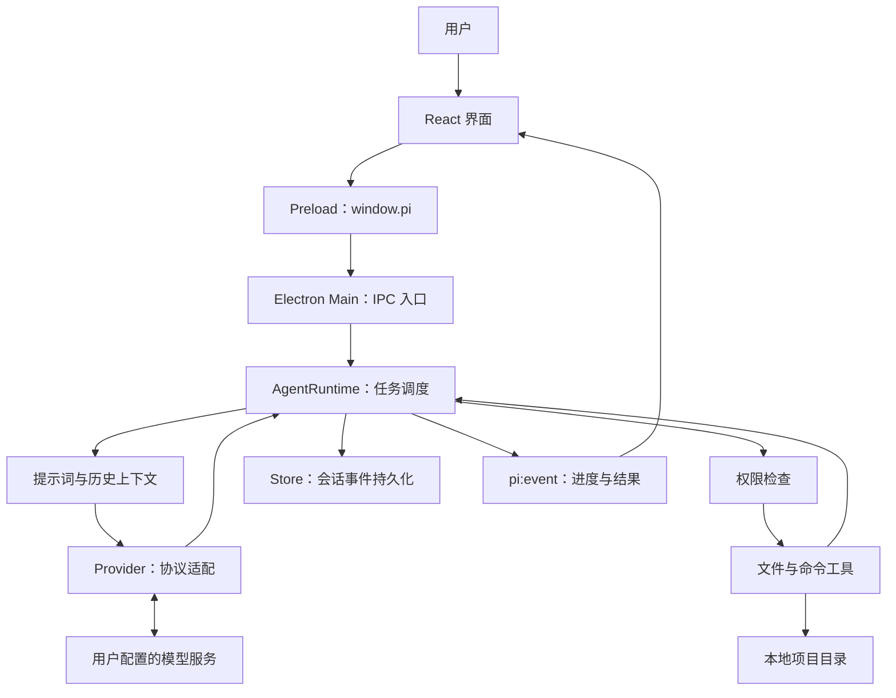
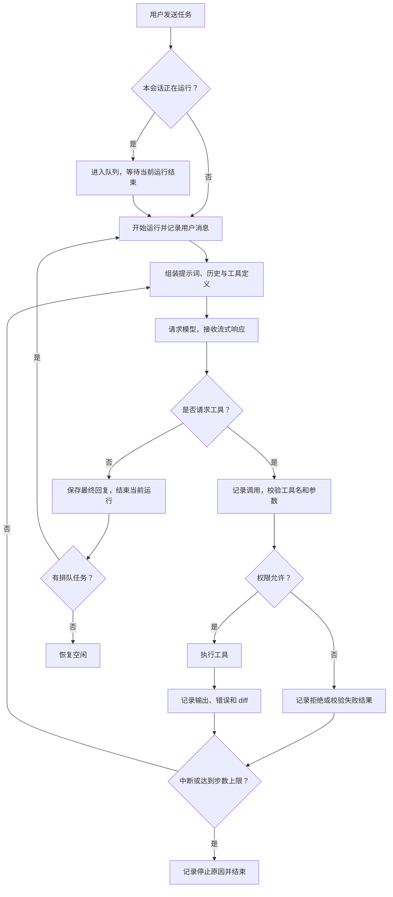
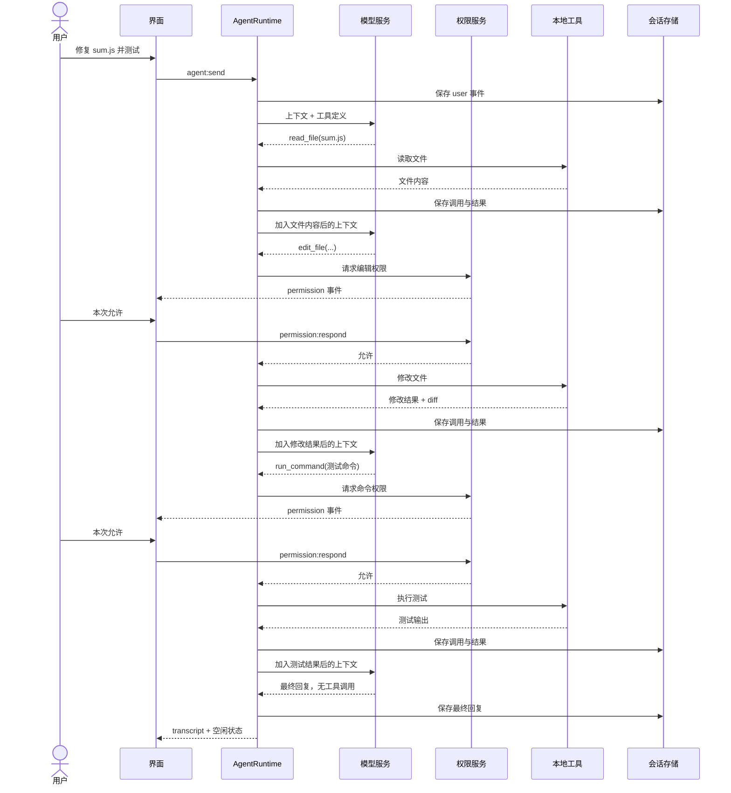

> 已停用：这是自研内核的历史方案。用户已明确采用本地 pi 作为内核。不得继续领取旧 A 系列任务；请阅读 [当前流程](./coding-agent-workflow.md) 和 [当前领取板](./agent-task-board.md)。

# Coding Agent 开发流程与本地实现导读

本文用于学习本地 PI Desktop 的工作原理，并作为下一阶段开发的依据。先理解一次任务怎样贯穿界面、模型和本地工具，再逐步实现完整闭环。

**状态说明：截至 2026-09-20，本地已有桌面应用骨架和主要模块，但 Agent 的多轮工具执行闭环尚未接通。本文明确区分“当前实现”和“目标流程”；图中的完整任务流程属于待完成的目标。**

产品形态参考 [vastsa/PI-Desktop](https://github.com/vastsa/PI-Desktop)：围绕本地项目组织会话、接入自选模型，并通过权限控制监督代理工作。参考项目采用 Electron、Rust 宿主核心与 pi Agent Harness；本地学习版采用 Electron、React 和 TypeScript 自研运行时，先聚焦核心链路，不要求复刻完整生态。

## 1. 先理解：Coding Agent 由什么构成

模型负责根据上下文提出下一步行动；运行时负责把行动变成真实的文件操作和命令执行，并把执行结果交回模型。

例如用户提出：“修复 `sum.js` 的加法错误，并运行测试。”模型需要看到文件内容才能定位问题，需要调用编辑工具才能修改磁盘，需要拿到测试输出才能判断是否修复成功。

| 概念 | 在本项目中的含义 |
| --- | --- |
| Project（项目） | 用户选择的本地工作目录 |
| Session（会话） | 同一项目中的连续对话，包含模型配置、模式和历史记录 |
| Run（一次运行） | 从开始处理一条用户消息到完成、失败或中断的过程 |
| Step（一个步骤） | 一次模型请求，以及该响应触发的工具执行 |
| Context（上下文） | 系统提示词、用户消息、历史回复、工具调用及结果 |
| Tool（工具） | 宿主提供的能力，例如读取文件、替换文本、执行命令 |
| Provider（模型适配器） | 将内部消息转换成具体服务的请求，并解析流式响应 |
| Harness / Runtime（运行时） | 调度模型、工具、权限、状态、停止条件和事件记录的程序 |

一个 Run 通常包含多个 Step。模型输出文字不一定表示结束，它可能同时要求调用工具；工具执行完毕后，需要继续请求模型。

## 2. 整体架构



三个进程职责需要分清：

- **Renderer**：展示消息、收集输入、展示权限弹窗和 diff，不直接调用 Node 文件系统。
- **Preload**：通过 `contextBridge` 暴露有限的 `window.pi` 接口，负责桥接。
- **Main**：保存数据、访问模型服务、执行工具和检查权限，是实际干活的宿主。

本地窗口已开启 `contextIsolation`、`sandbox` 并关闭 `nodeIntegration`。这些设置隔离的是渲染进程，**不意味着主进程启动的 shell 命令具有操作系统沙箱**。

## 3. 从启动到可以发送任务

### 3.1 应用启动

生产流程：`pnpm build` 编译主进程、preload 与前端，再通过 `pnpm start` 启动 Electron。

`src/main/index.ts` 在 `app.whenReady()` 后注册 IPC，并创建窗口；窗口加载编译后的前端页面和 preload。React 初始化时，通过 `window.pi` 获取设置、项目和提供商列表，然后订阅 `pi:event`。

开发模式由 `scripts/dev.mjs` 启动 TypeScript 编译、Vite 和 Electron。当前脚本只等待 Vite 端口，没有等待主进程编译完成；首次开发启动的编译顺序仍需完善。

### 3.2 配置模型

```text
设置界面填写提供商、Base URL、API Key、模型名称
  → window.pi.saveProvider()
  → providers:save IPC
  → Store.saveProvider()
  → 保存 models.json
  → 返回隐藏 Key 的 ProviderView 给界面
```

Provider 决定请求协议和服务地址，Model 决定请求中的模型标识。例如同一个兼容接口提供商可以配置多个模型。

API Key 在保存时优先使用 Electron `safeStorage` 加密；当前代码在加密不可用时会退回带 `plain:` 前缀的 Base64 编码，这不属于加密，不能把“始终安全加密”当作已完成能力。

### 3.3 添加项目、创建会话

用户选择项目目录后，`Store.addProject()` 检查目录并生成项目 ID。创建会话时，`Store.createSession()` 写入 `meta.json`；IPC 层通过 `trackSession()` 注册会话与项目的对应关系。

会话需要选定模型，运行时才能通过 `resolveModel()` 找到提供商、模型参数和解密后的 Key。

## 4. 一条任务的完整目标流程



### 第一步：用户输入经过 IPC 到达宿主

实际调用链：

```text
Composer.submit()
  → renderer/store.ts：sendPrompt(text)
  → window.pi.sendPrompt(sessionId, text)
  → preload：ipcRenderer.invoke('agent:send', ...)
  → main：ipcMain.handle('agent:send', ...)
  → AgentRuntime.sendPrompt()
```

界面不依赖这次 IPC 的最终返回值逐字更新，而是监听宿主主动推送的事件。这样即使任务运行较久，界面也能持续展示进度。

### 第二步：准备上下文

`systemPrompt()` 生成身份、项目路径、工作规则和模式指令。`buildChatMessages()` 把持久化事件转换成模型可以理解的消息。

目标消息结构示意：

```text
system：你是本地编程代理，当前项目为……
user：修复 sum.js 并运行测试
assistant：调用 read_file，调用 ID 为 call_1
tool：call_1 的结果，文件内容为……
assistant：调用 edit_file，调用 ID 为 call_2
tool：call_2 的结果，修改成功
assistant：调用 run_command，调用 ID 为 call_3
tool：call_3 的结果，测试通过
assistant：已修复并验证……
```

工具结果必须与调用 ID 对应。恢复会话时，也需要对缺失结果的调用给出明确状态，避免产生不完整的工具消息序列。

当前 `@文件` 功能只是把路径文本插入输入框，不会自动把文件全文放入上下文；仍需由模型调用 `read_file`。当前也没有实现上下文 token 预算、压缩或摘要，长会话不能无限追加历史。

### 第三步：模型请求与流式解析

运行时把 `ChatRequest` 交给 `createProvider()`。适配器负责把内部统一格式转换成服务端协议：

| 适配器 | 当前请求路径 | 工具协议 |
| --- | --- | --- |
| OpenAI Compatible | Base URL 后追加 `/chat/completions` | `tool_calls` 与 `tool` 消息 |
| Anthropic | Base URL 后追加 `/v1/messages` | `tool_use` 与 `tool_result` 内容块 |

服务端通过 SSE 分片返回内容，`sseData()` 读取数据，Accumulator 拼接文字和工具参数。工具参数可能被拆成多段 JSON 字符串，需要收集完整后再解析和执行。

内部输出统一为 `text-delta`、`tool-call`、`usage`、`done`。这样运行时不必直接处理每个模型服务的协议细节。

### 第四步：工具校验与权限检查

模型提出工具名和参数，宿主查找 `toolByName()`，解析参数，再调用 `PermissionService.check()`。模型输出的工具调用属于执行请求，真正是否执行由宿主决定。

目标校验包括：工具是否存在、JSON 是否有效、参数类型是否正确、必填字段是否齐全、路径是否允许。当前主要依赖 JSON 解析和各工具自己的参数检查，没有统一的 JSON Schema 参数验证。

当前权限规则：

| 工具类别 | `ask` | `autoEdit` | `fullAccess` | 未批准的 Plan |
| --- | --- | --- | --- | --- |
| 读取 | 允许 | 允许 | 允许 | 允许 |
| 写文件 | 询问 | 允许 | 允许 | 阻止 |
| 执行命令 | 询问 | 询问 | 允许 | 阻止 |

询问流程：主进程生成 `requestId` → 推送 `permission` 事件 → 界面展示请求 → 用户选择本次允许、会话允许或拒绝 → `permission:respond` 找到等待中的 Promise → 恢复执行。

当前“本会话允许”按工具名称授权，例如允许 `run_command` 后，该会话的后续命令都会放行，并非只允许同一条命令。

### 第五步：执行工具并记录结果

| 工具 | 功能 | 典型返回 |
| --- | --- | --- |
| `list_dir` | 浏览目录 | 文件与子目录列表 |
| `read_file` | 分行读取文本 | 带行号的内容 |
| `grep` | 搜索项目文本 | 路径、行号和匹配行 |
| `write_file` | 创建或覆盖文件 | 执行结果和 diff |
| `edit_file` | 精确替换文本 | 执行结果和 diff，或匹配失败原因 |
| `run_command` | 运行构建、测试等命令 | stdout、stderr、失败原因 |

工具失败是模型继续决策所需的信息。例如替换文本不存在时，把失败原因交回模型，它才能重新读文件并调整修改方案。用户拒绝也是一种工具结果，模型应尊重该决定，不应自动换工具绕过拒绝。

当前文件路径检查只检查解析后的路径前缀，没有完整检查符号链接指向；命令工具也只是设置工作目录。这些机制不能被描述成完整的文件系统隔离。

### 第六步：将工具结果交回模型

这是需要优先补齐的核心代码。目标是每次执行完工具后，重新构建包含结果的上下文，再进行下一次模型请求。

以下是**设计伪代码，不是当前已经实现的函数**：

```ts
async function runTask(task, signal) {
  persistUserMessage(task);

  for (let step = 0; step < MAX_STEPS; step++) {
    if (signal.aborted) return finish('interrupted');

    const response = await requestModel(buildContext(), signal);
    persistAssistantResponse(response);

    if (signal.aborted) return finish('interrupted');
    if (response.toolCalls.length === 0) return finish('completed');

    for (const call of response.toolCalls) {
      persistToolCall(call);
      // 校验失败、拒绝、执行失败都应产生与 call.id 对应的结果。
      const result = await validateAuthorizeAndExecute(call, signal);
      persistToolResult(call.id, result);
    }
    // 继续下一轮模型请求，让模型读取刚刚记录的工具结果。
  }

  return finish('step_limit');
}
```

达到步数上限要明确告知用户“已停止，任务可能未完成”，不能包装成成功。没有工具调用只能表示模型结束了此次交互；是否真正完成需求，还要看测试、diff 和用户的验收标准。

### 第七步：完成、保存与审查

主进程将回复、工具调用与结果追加到 `events.jsonl`，同时经由 `pi:event` 更新界面。写入工具会返回 diff，Review 面板从会话记录中提取这些改动。

当前 Review 对每个文件只保留最近一次工具返回的 diff。因此同一文件多次修改时，它不是“会话开始到现在”的累计差异；通过 shell 修改的文件也不会自动出现在此面板。后续应引入文件基线或 Git 差异计算。

## 5. 一次任务的时序图

此图展示补齐循环后的目标流程。每个模型请求之间都必须有真实工具结果进入上下文。



## 6. 三种模式如何影响流程

| 模式 | 目标行为 | 当前实现 |
| --- | --- | --- |
| Agent | 直接执行任务，权限层仍然生效 | 提示词与权限已存在，多轮循环待补齐 |
| Plan | 只研究，输出计划，批准后继续执行 | 有模式提示词、写入/命令阻止和批准标记；点击批准目前不会自动启动执行 |
| Goal | 按目标与验收条件持续工作 | 目前只是提示词指导，没有独立的目标进度、持久化预算或恢复状态机 |

Plan 批准后的目标流程为：验证当前确实有待批准计划 → 记录所批准计划的版本 → 更新状态 → 发送一次明确的继续执行请求。修改计划或开始新计划时，应重新管理批准状态。

当前 Plan 提示词提到可执行只读命令，但权限实现会阻止全部 `exec` 工具。开发时需要统一规则；学习版可以先只允许三个读取工具，避免靠命令文字判断是否只读。

## 7. 排队、中断与异常流程

### 7.1 排队

目标规则：同一会话最多一个运行中的任务，后续输入按顺序处理。排队消息可以展示为待处理，但不应在当前任务执行到一半时混入它的模型上下文。

当前 `sendPrompt()` 在检查队列前就将新消息写入历史，`turn()` 又直接读取全部历史，而且 `_prompt` 参数未被使用。后续需要明确区分“消息已收到”和“消息开始执行”，并让队列消费与上下文边界一致。

### 7.2 中断

目标传播链：

```text
用户点击停止
  → 只中断对应 session 的运行
  → AbortSignal 取消模型请求
  → 取消该会话正在等待的权限确认
  → 停止正在执行的命令及必要的子进程
  → 记录未执行工具的取消结果
  → 保存已有文字与停止原因
  → 清理流式显示和运行状态
```

中断不会自动撤销已经完成的文件写入；撤销需要另行设计。中断后的队列应采用明确策略，建议第一版清空并提示取消，避免停止后继续执行排队任务。

当前模型请求已接入 `AbortSignal`，但命令工具未接入；权限取消调用的是全局 `cancelAll()`，会影响其他会话；队列也未明确清空。这些是待修复行为。

### 7.3 异常处理

| 情况 | 目标处理 |
| --- | --- |
| 未选择模型、配置不存在 | 在启动前给出可操作提示 |
| 模型网络错误或鉴权失败 | 保存错误，结束运行，允许用户修正后重试 |
| 无效工具名或 JSON 参数 | 保存调用及失败结果，交回模型修正 |
| 文件不存在、替换不匹配、测试失败 | 作为工具结果交回模型继续处理 |
| 用户拒绝 | 保存拒绝结果，按权限边界继续或说明阻塞 |
| 请求结束时工具参数不完整 | 不执行部分参数，报告协议错误 |
| 步数耗尽 | 结束并明确标注尚未完成 |
| 应用关闭或崩溃 | 保留已持久化事件；重启显示未完成状态，不自动重复写入操作 |

## 8. 数据与事件如何保存

数据根目录由 Electron `app.getPath('userData')` 决定，不是用户选择的代码目录。

```text
userData/
  settings.json
  models.json
  projects.json
  sessions/<projectId>/<sessionId>/
    meta.json
    events.jsonl
```

| 数据 | 内容 | 用途 |
| --- | --- | --- |
| `meta.json` | 会话 ID、模型、模式、标题、时间、批准标记 | 会话列表和运行配置 |
| `events.jsonl` | user、assistant、tool_call、tool_result、error、notice、plan | 回放界面与构建模型历史 |
| 临时 IPC 事件 | message-start、text-delta、status、usage | 实时渲染和运行反馈 |

当前文字增量先在内存和界面中累积，完成或捕获中断后才尝试保存助手消息，并非逐 token 持久化。进程意外退出仍可能丢失当前未保存的输出。

当前 `readEvents()` 遇到任意一行 JSON 解析失败会返回整个空数组。后续应逐行处理，恢复有效记录并报告损坏行，尤其要处理崩溃留下的不完整尾行。

## 9. 本地代码阅读路线

以下路径均相对仓库根目录。建议按顺序阅读，在 IDE 中沿函数调用跳转。

| 顺序 | 文件 | 重点理解 |
| --- | --- | --- |
| 1 | `src/shared/types.ts` | 项目、会话、事件、权限的领域模型 |
| 2 | `src/shared/api.ts` | UI 能调用哪些宿主能力 |
| 3 | `src/renderer/components/Composer.tsx` | 输入、发送、停止和路径引用 |
| 4 | `src/preload/index.ts` | `window.pi` 如何转换为 IPC |
| 5 | `src/main/index.ts` | 应用启动、IPC 注册、权限 Promise |
| 6 | `src/main/agent/runtime.ts` | 运行、排队、模型调用与工具调度 |
| 7 | `src/main/agent/prompt.ts` | 模式提示词与历史转换 |
| 8 | `src/main/providers/base.ts` | 模型适配器的统一抽象与 SSE 读取 |
| 9 | `src/main/providers/openai.ts`、`anthropic.ts` | 流式文本和工具调用解析 |
| 10 | `src/main/agent/permissions.ts`、`tools.ts` | 权限决策与实际文件/命令操作 |
| 11 | `src/main/store.ts`、`secrets.ts` | 本地数据和密钥保存 |
| 12 | `src/renderer/store.ts`、`components/ChatView.tsx` | 事件如何驱动界面 |
| 13 | `src/shared/diff.ts`、`src/renderer/components/ReviewPanel.tsx` | 改动如何展示 |

## 10. 当前实现缺口与开发顺序

### 阶段一：让 Agent 真正完成一条任务

优先改动运行时、工具结果协议和相关测试。

- 将“单次请求 + 工具执行”放进有界循环。当前 `turn()` 在执行工具后直接返回；外层 `loop()` 只消费用户队列，不能替代 Agent 循环。
- 让现有 `MAX_STEPS = 30` 真正参与停止判断，目前它只被声明。
- 确保未知工具、无效参数、拒绝和执行失败都有配对的调用与结果；当前无效 JSON 分支只记录结果。
- 为纯工具响应、流式异常和中断明确发送消息结束信号，避免界面遗留空的流式占位。
- 用可控的假 Provider 验证“读取 → 编辑 → 测试 → 最终回复”，无需真实 API Key。

**验收：** 用户只发送一次任务，运行时完成至少三次工具调用及后续模型请求；测试输出真实进入上下文；每个调用都有结果；最后恢复空闲。

### 阶段二：完善队列与生命周期

- 将排队消息和当前运行上下文分开，逐条消费，避免重复处理。
- 将取消信号传播到权限等待和命令执行，按会话隔离。
- 统一 `running`、`awaiting_permission`、`awaiting_plan` 的宿主状态与界面状态。
- 处理切换会话时的权限请求和流式状态；当前界面会忽略非当前会话的权限事件。
- Plan 批准后自动继续执行，且仅对对应计划有效。

**验收：** 连续发送两条任务不会互相混入上下文；停止会话 A 不影响会话 B；等待权限和执行命令时都能停止；停止后不会擅自启动排队任务。

### 阶段三：使本地执行与存储更可靠

- 统一参数校验，补全符号链接路径检查，并准确说明 shell 权限范围。
- 修复无 Key 的本地兼容服务接入：当前运行时统一拒绝空 Key，尽管兼容适配器支持省略鉴权头。
- 对密钥加密不可用的情况采取明确策略。
- 容忍 JSONL 损坏尾行，考虑原子写入配置与运行恢复标记。
- 让 Review 展示累计改动，并覆盖命令导致的文件变化。
- 增加上下文预算与摘要，避免长会话超过模型窗口。

**验收：** 外部符号链接不会被文件工具读写；历史尾行损坏不会清空整段会话；无 Key 本地服务可接入；同一文件多次修改后的 Review 与实际净变化一致。

### 阶段四：扩展能力

在核心闭环稳定后，再逐项学习 MCP、Skills、子代理、插件系统、Git 工作树和更严格的执行沙箱。每个扩展都应复用已有的权限、事件与生命周期机制。

## 11. 学习与验证练习

建议建立一个独立的小练习项目，包含一个有错误的加法函数和一个本地测试脚本，避免第一步就用复杂业务项目验证。

1. **读代码练习**：跟踪一次“列出目录”请求，找到输入、模型响应、工具执行、结果记录各自的位置。
2. **协议练习**：假 Provider 第一次返回 `read_file`，第二次根据工具结果输出总结，验证运行时确实进行了第二次请求。
3. **编辑练习**：假 Provider 请求 `edit_file`，在权限弹窗中分别允许和拒绝，检查真实文件与事件记录。
4. **闭环练习**：依次请求读取、编辑、测试、总结，检查测试失败时能否继续修复。
5. **中断练习**：分别在模型输出、等待权限、命令执行时停止，检查状态与子进程。
6. **恢复练习**：重启应用加载会话，再模拟不完整 JSONL 尾行，检查历史恢复行为。

当前基础校验命令：

```bash
pnpm typecheck
pnpm test
pnpm build
```

编写本文前，本地类型检查和现有 19 个测试通过。现有测试主要覆盖消息转换、权限决策、部分工具、diff 和流式累积器，尚未覆盖完整 AgentRuntime 多轮运行；因此测试通过不能证明完整代理流程已实现。本文不代表真实模型端到端验收，后续需要按上述验收场景补充测试。
