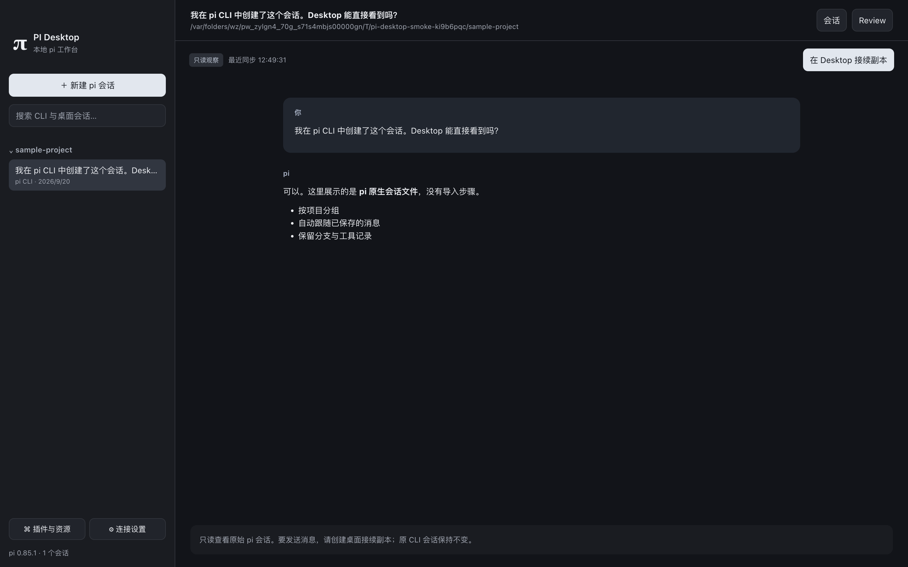
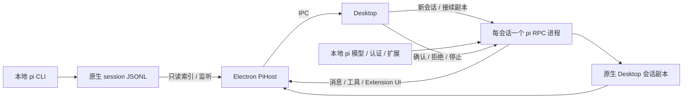

# 第二阶段：本地 pi 接入交付

后续更新：生产入口已融合复刻 UI；设置页、MCP 工具桥与独立子代理已补齐，最新功能与验证见 [设置页交付](./settings-implementation.md)。以下保留第二阶段初次接入记录。

日期：2026-09-20。用户明确要求执行第二阶段，因此提前接入本地 pi；UI 复刻工作仍由其他 Agent 并行进行。生产入口已使用本地 pi，不再走旧 AgentRuntime/Provider。当前任务卡设为“待验收”，不代表整个视觉复刻已验收。

## 使用方法

```bash
pnpm build
pnpm start
```

1. 启动即显示本地 CLI sessions，不需要添加项目或导入。左侧按会话 header 的 cwd 分组；选择后可看 Markdown、工具结果、思考记录、压缩记录与扩展条目。
2. 在 CLI 中追加并保存记录，桌面自动更新。界面显示“只读观察”和同步时间；落盘同步不等于 CLI 逐字输出或进程忙闲状态。
3. 点击“在 Desktop 接续副本”，或“新建 pi 会话”选择目录。默认逐次确认工具，项目资源信任另行选择。原 CLI 文件不会被写入。
4. 从 pi 提供的模型列表选择模型，发送输入；`/` 展示实际加载的命令。运行中可以排队追问、调整任务或停止。
5. “插件与资源”扫描全局/项目原生资源及包引用，展示路径、范围、发现/排除/可调用状态。安装仍使用终端的 `pi install`；Desktop 不再安装第二份。空闲时“重载扩展”重启当前连接。
6. “连接设置”可覆盖可执行路径、配置目录和额外 session 目录，修改前需断开连接。认证在 pi CLI 配置，不复制到 Desktop 表单。
7. Review 展示项目 Git 工作区相对 HEAD 的累计净变化和未跟踪文件列表。它包含此前用户改动及其他会话改动，不能归因成当前会话的独占成果。



截图由真实 Electron 窗口生成，内容是临时目录内明确构造的会话夹具；没有使用用户私有聊天截图。正常运行读取真实目录，绝不静默降级为演示数据。

## 实现导航与学习顺序

| 模块 | 文件 | 学习重点 |
| --- | --- | --- |
| 共享协议 | src/shared/pi.ts | 保持桌面契约与 pi SDK 解耦 |
| 安装发现 | src/main/pi/environment.ts | GUI PATH、配置根与版本门控 |
| 只读会话 | src/main/pi/session-index.ts | JSONL 完整行、分支树、监听与轮询 |
| 进程通信 | src/main/pi/rpc-client.ts | 子进程、分帧、请求关联与退出清理 |
| 会话执行 | src/main/pi/backend.ts | 多会话、事件、队列、代际与标准 UI 交互 |
| 资源扫描 | src/main/pi/resource-catalog.ts | 静态发现与实际运行证据的区别 |
| 工具确认 | extensions/desktop-policy/index.mjs | pi tool_call 钩子与交互回包 |
| Desktop 宿主 | src/main/pi/host.ts、src/main/index.ts | 生命周期、IPC、只保存 Desktop 路径配置 |
| 桌面界面 | src/renderer/pi/PiDesktop.tsx | RPC 事件与原生历史汇合、插件展示 |
| 工作区审查 | src/main/pi/workspace-review.ts | Git 基线、真实净变化与归因边界 |



旧 `src/main/agent`、`providers` 与旧存储文件保留，没有迁移、覆盖或删除；它们已不在生产调用链。旧格式历史的可视化迁移尚未提供。生产样式使用 `native-*`，避免与并行的 `replica/preview` 样式冲突。集成收尾仅修正预览 Sidebar 空状态中已删除的 query 引用，未调整其视觉或交互设计。UI 预览入口 `?preview=1` 保持独立；待 U07 验收后可将已验收视觉组件接到 `window.localPi` 契约。

## 验证记录

- 本机 pi：`@earendil-works/pi-coding-agent` **0.85.1**，macOS；没有把 Linux 或 Windows 当作实测平台。
- `pnpm typecheck`：通过。
- `pnpm build`：通过，包含原生工作台与独立预览产物。
- `PI_TEST_EXECUTABLE=/opt/homebrew/bin/pi PI_TEST_PLAN_EXTENSION=/Users/jason/.pi/agent/extensions/plan-mode pnpm exec vitest run tests`：**39 项通过**（19 项保留的旧测试、20 项 pi 相关测试）。不设置 PI_TEST_EXECUTABLE 时跳过真实进程联调。
- 真实 pi 联调使用临时 agentDir、临时工作区与 localhost SSE 预设模型服务：read → 工具确认 → write → 模型结果；拒绝后确认目标文件未创建；四种 Extension UI 返回值；取消等待中的确认；原文件保护；同一副本重启与新 generation。
- 复制本机 plan-mode 到临时目录，验证 `/plan`、`/todos` 命令注册、模式切换和状态事件。未宣称完整计划生成、TUI 自定义交互均已兼容。
- Electron 生产窗口 smoke：正常 preload、IPC、自动发现原生 session 和历史渲染，退出码 0；截图如上。未调用外部模型服务，未修改用户 `~/.pi`。
- 最终全量测试（启用真实 pi 联调）为 **15 个测试文件、71 项全部通过**，包含另一 Agent 的 UI 预览测试；最终全量类型检查与构建通过。

可重复的真实联调命令（路径按本机安装调整）：

```bash
PI_TEST_EXECUTABLE="/opt/homebrew/bin/pi" \
PI_TEST_PLAN_EXTENSION="$HOME/.pi/agent/extensions/plan-mode" \
pnpm exec vitest run tests
```

PI_TEST_PLAN_EXTENSION 可省略；联调复制扩展到临时目录执行，没有读取或复制真实认证。测试服务回复为预设内容，验证真实 pi 调用链，不属于真实远程模型智能效果验收。

## 当前边界与后续验收

- 执行仅开放可识别 npm 安装的 0.85.1；其他版本只读，避免把不确定协议当成兼容。Windows 执行未启用。
- CLI 原会话只能观察；Desktop 接续是副本。对选定旧分支的写入接续、CLI/Desktop 同时逐 token 镜像未提供。
- JSONL 扫描缓存文件元数据，变化文件重新解析；监听失败有 1.2 秒轮询。单文件读取上限 64 MiB、目录深度 8；大规模会话库后续需分页与增量偏移解析。
- 原生图片历史目前显示占位说明；未提供附件上传和文件引用选择器。纯终端自定义组件、主题、快捷键与 factory widget 不能自动展示；标准 select/confirm/input/editor、notify/status/widget/title/editor text 已桥接。
- 静态包目录与常见 glob 规则可以展示；完整 pi 包过滤语义及各种 Git URL 形式尚未逐项对齐。只读发现不会宣称“插件已加载”；命令可调用以 get_commands 为证据。纯钩子扩展没有完整运行态清单。
- 资源目录或 settings 变化会提示重载；嵌套文件内容变更未全部自动监听，使用“重新扫描 / 重载扩展”。插件运行错误显示通知，任意插件的启动 stderr 仅显示脱敏诊断。
- 工具权限是 pi 钩子确认，不是 OS 沙箱，参见 [权限边界](./pi-permission-boundary.md)。没有重复实现 Plan/Goal。
- Review 为整个工作区相对 HEAD 的 diff，上限 2 MiB、10 秒超时；未跟踪文件仅列路径；非 Git 项目说明不可用。不修改用户文件。
- 还需用户实际模型账号的端到端验收、真实扩展组合兼容性验收，以及 U07 后视觉组件融合。没有提交、推送、安装新插件或调用外部模型计费接口。
