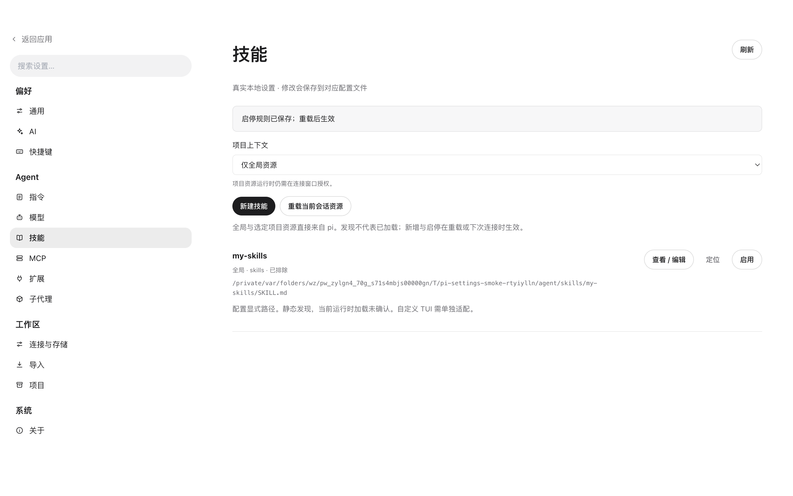
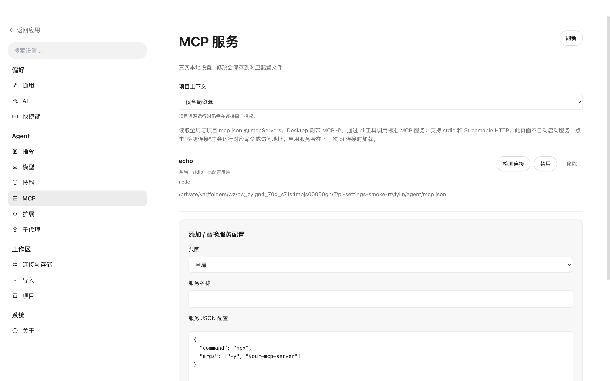
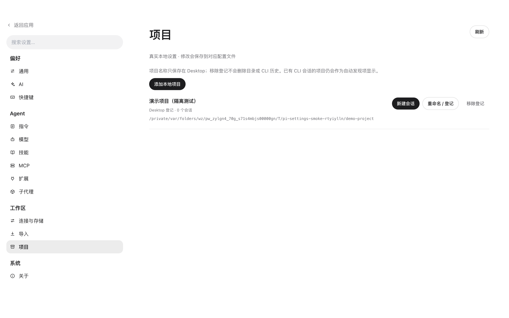

# 设置页面实现与验收

日期：2026-09-20。生产入口为 `PiReplicaApp`，本次直接补齐现有复刻界面的设置页。纯演示预览仍使用其独立 fixtures，不访问用户数据。

## 当前可用功能

| 页面 | 实际行为 | 保存 / 数据源 |
| --- | --- | --- |
| AI | 设置默认提供商、模型、推理级别、自动压缩与重试；设置 Desktop 输入策略和默认工具权限 | pi settings.json + Desktop preferences |
| 快捷键 | 编辑搜索、新建会话、设置、工作面板、侧栏、停止的快捷键；校验格式与冲突，保存立即生效 | Desktop preferences |
| 指令 | 读取全局与项目 AGENTS.md，以及继承的上级指令；新建、编辑当前范围指令和 / 提示词模板 | 原生 Markdown 文件 |
| 技能 | 查看全局、项目、共享 .agents 和配置引用的技能；新建、编辑、启停、定位文件 | skills 目录及 settings.json 过滤规则 |
| MCP | 查看配置、添加或替换服务、启停、移除、连接检测和工具枚举；pi 中实际调用工具 | 全局 / 项目 mcp.json 的 mcpServers |
| 扩展 | 读取真实扩展入口；新建源码、查看编辑、启停和重载当前连接 | extensions 目录及 settings.json |
| 子代理 | 查看编辑 agents/*.md；以定义的系统指令、model 和内置 tools 白名单启动独立 pi 会话 | agents 目录 + PiBackend |
| 连接与存储 | 选择 pi 路径、配置根、额外 session 目录，查看并断开活动连接 | 原有 Desktop 连接配置 |
| 导入 | 选择原生 pi JSONL，验证后复制；保留分支、更换 ID、按内容去重，原文件不变 | `<agentDir>/sessions/desktop/import_<hash>.jsonl` |
| 项目 | 登记本地目录、命名、显示会话数与失效目录、创建会话、移除登记；空项目显示在侧栏 | Desktop preferences + CLI session.cwd |

通用、模型与关于保留原有实现。未知版本也可以进入设置或浏览历史，不再陷入“打开连接设置”却无法打开的整页阻断。

## MCP 与子代理的真实边界

pi 0.85.1 核心本身不内置 MCP 或子代理。本次通过宿主提供的 `mcp-bridge.mjs` 加载 MCP，并复用 pi 原有模型与工具循环；没有自行重写模型循环。

- MCP 支持 **stdio** 和 **Streamable HTTP**，包含 initialize、工具分页、工具调用、取消、请求超时与连接清理。进程参数通过数组传入，不经过 shell。HTTP 不自动跟随重定向。
- 页面扫描不启动服务；点击检测会运行对应命令或访问该服务。检测用完关闭连接。启用的全局服务在下一次 Desktop pi 连接时加载；项目服务仅在该连接信任项目时加载。同名项目服务覆盖全局项。
- 工具注册为稳定的 `mcp_<server>_<hash>_<tool>` 名称，实际调用仍经过 Desktop 的 tool_call 确认。启动进程 / initialize 本身不是工具调用，受所选 MCP 配置信任约束。
- “已配置启用”和“连接检测成功”不冒充当前 pi 会话已加载。成功加载会产生 MCP 状态；失败会通知，其他服务仍可用。
- 暂不实现旧式 HTTP+SSE 传输、MCP OAuth 登录、资源 / 提示词 API、sampling、elicitation，以及其他产品的 `imports` 转换；存在 imports 会显示具体说明。已有 env / headers 等认证不回传到列表；编辑同名服务需明确提交完整配置。
- 子代理采用**独立 pi 会话**。定义中的正文追加为系统指令；`tools` 支持逗号分隔的 pi 内置工具名，`model` 是可选模型 ID。默认逐次确认，不继承项目资源信任。用户可在侧栏跟踪、停止和查看它。
- 当前不是自动多代理编排：不会自动拆分任务、共享父会话上下文或把结果注入主会话。需要主代理自动派发时应继续适配所选 pi 扩展协议，不能仅凭 agents/*.md 宣称已支持整套编排。

## 配置与数据保护

- Desktop 自身的默认行为、快捷键、项目列表保存在 Electron userData 的 `desktop-preferences.json`，不会混入 pi 的配置。
- 修改 pi settings.json / mcp.json 时只合并所需字段，保留未知项。每次修改已有文件先生成 `*.desktop-backup-<timestamp>-<id>` 备份，使用临时文件与 rename 保存。
- AI、资源编辑和 MCP 操作带文件内容版本。文件在外部变化时拒绝覆盖，提示刷新后重试。编辑文件限制 512 KiB，禁止通过符号链接写入。
- 包内源码、共享目录技能及继承的上级指令只读，避免编辑破坏原包。可定位到源文件后由用户选择外部工具管理。
- 默认权限只影响新连接；不会升级已有连接。项目信任仍在每次连接时明确选择。
- 导入只支持原生 pi JSONL；损坏输入、旧 Desktop events.jsonl 与其他产品格式不会伪装导入成功。源文件不改写，重复内容不重复复制。
- 项目移除只移除 Desktop 登记，磁盘目录和 CLI 会话均保留；因此有 CLI 历史的项目仍能自动出现。

## 代码入口

- `src/shared/settings.ts`：设置契约与快捷键匹配。
- `src/main/pi/settings-service.ts`：配置、资源、项目、导入、MCP 检测及子代理启动。
- `extensions/desktop-policy/mcp-client.cjs`：MCP 协议传输与生命周期。
- `extensions/desktop-policy/mcp-bridge.mjs`：MCP 工具注册到 pi；随 Desktop 权限扩展目录一同打包。
- `src/renderer/pi/SettingsFeatures.tsx`：真实设置页面；复用现有导航与视觉变量。
- `src/main/pi/settings-smoke.ts`：仅在显式隔离 smoke 模式调用的桌面交互验收。

## 验证

- `pnpm typecheck` 与 `pnpm build` 通过。
- 全量测试启用真实 pi：19 个文件、92 项测试通过；包含新增配置保护、快捷键冲突、资源编辑与范围、导入去重、MCP 脱敏和协议测试。
- 真实 pi 0.85.1 + 临时工作区 + localhost SSE 预设模型：原有对话与权限测试通过；模型实际调用 fake MCP 的 echo 工具，调用前出现工具确认；独立子代理的系统指令进入模型上下文，工具列表确实限制为 read。
- Electron 实际点击全部 13 个设置入口，均无生产占位提示；通过表单保存 AI 默认值、修改快捷键后实际触发搜索、创建编辑并禁用技能。
- 所有写入验证都在临时 agentDir / userData / 项目中执行，没有改写用户真实 pi 配置、没有连接用户 MCP 服务、没有调用付费外部模型。

测试命令：

```bash
pnpm typecheck
PI_TEST_EXECUTABLE=/opt/homebrew/bin/pi \
PI_TEST_PLAN_EXTENSION="$HOME/.pi/agent/extensions/plan-mode" \
pnpm test
pnpm build
```

`PI_TEST_PLAN_EXTENSION` 可省略。Electron 的设置 smoke 需要显式设置独立 `PI_CODING_AGENT_DIR`、`PI_DESKTOP_DATA_DIR`，然后运行 `PI_SMOKE=2 PI_SMOKE_SETTINGS=1 pnpm start`；它会在测试配置中创建并修改资源，不应对真实配置运行。

截图：






